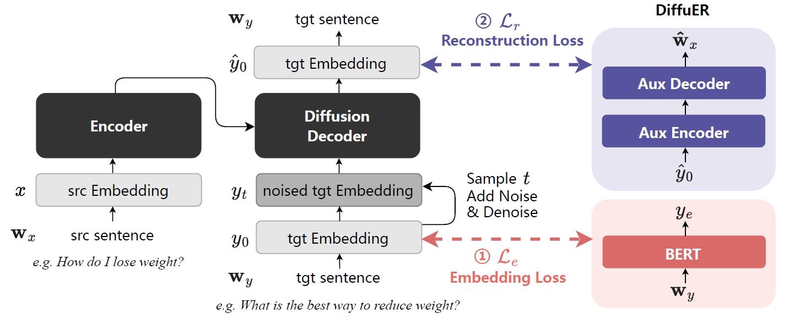

# DiffuER

This repo contains the code for `DiffuER: Auxiliary Regularized Diffusion Model for Text Generation with Semantic Consistency`

## 📄 Overview

we propose DiffuER (Diffusion with Embedding and Reconstruction loss). By utilizing word embeddings from a pre-trained masked language model as auxiliary regularization and leveraging a simple encoder-decoder module to reconstruct the original text from the generated sequence, our proposed method enhances the model’s capability of semantic consistency.

<div align=center></div>

Experimental results across four types of text generation tasks demonstrate DiffuER’s superiority in terms of generation quality, fluency, diversity and semantic consistency, outperforming AR, NAR and diffusion-based language models with the same model architecture and the number of parameters.


## ⚙️ Experiment Setup

**Virtual Env Configurateion**

To run the following command, a anaconda should be installed.

```shell
conda create -n diffuer python=3.10       # create an conda env named `diffuer`
conda activate diffuer                    # enter the conda env
pip install torch torchvision torchaudio --extra-index-url https://download.pytorch.org/whl/cu118 # install torch
pip install -r requirments.txt            # install dependencies
```

Additionally, refer to `https://github.com/pltrdy/files2rouge` to install files2rouge in the current env.

**Dataset:**

- Paraphrase: [QQP](https://www.kaggle.com/c/quora-question-pairs)
- Text simplification: [](https://huggingface.co/datasets/bogdancazan/wikilarge-text-simplification)
- Machine translation: IWSLT2014
- Text summarization: [XSum](https://huggingface.co/datasets/EdinburghNLP/xsum)

**Model**

Built on transformer architecture, with a model size of 16M parameters.


## Training

To train a model
- run `bash scripts/run_qqp.sh` to train, inference and evaluate the QQP dataset.
- run `bash scripts/run_ts.sh` to train, inference and evaluate the text simplification dataset.
- run `bash scripts/iwslt.sh` to train, inference and evaluate the iwslt2014 dataset.

In the scripts, you can enable the pratrained embedding loss to set `USE_TEACHER=True` and enable the reconstruction loss to set `USE_AUX_AR_MODEL=True`


## Repo Reference

We appreciate the open source of the following projects:
- [AR-Diffusion](https://github.com/microsoft/ProphetNet/tree/master/AR-diffusion)
- [Diffusion-LM](https://github.com/XiangLi1999/Diffusion-LM)

## 📜 Citation

Available soon.
